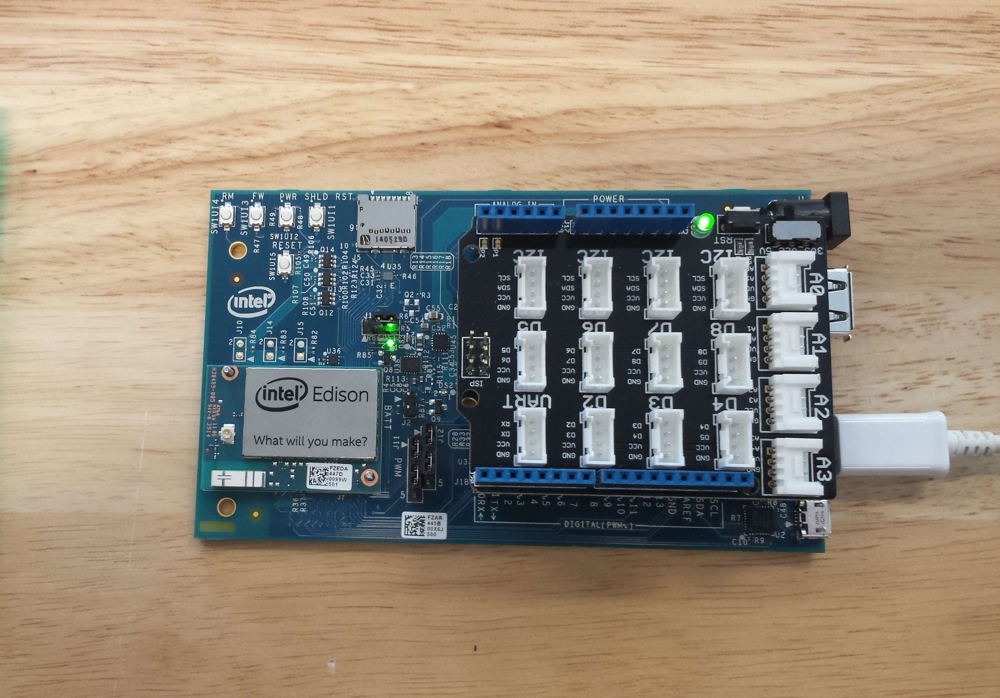

##SUMMARY
####What is a Maraca?
A maraca is a percussion musical instrument, kind of like rumba shakers, from Latin America. Read more [here](https://en.wikipedia.org/wiki/Maraca).

As an introduction on the [IoT (Internet of Things)](https://en.wikipedia.org/wiki/Internet_of_Things), I spent the day at [AWS pop-up loft](https://aws.amazon.com/start-ups/loft/) during #AWSIOHACKDAY. We had the opportunity to assemble a connected maraca that streams data to AWS Services, so that you then see real-time data on a dashboard.

###Intel Edison Module
The Intel® Edison module is a SoC (System on Chip) that includes an Intel® Atom™ 500MHz dual-core, dual-threaded CPU and an Intel® Quark™ 100MHz microcontroller. Read more about the [Kit for Arduino](https://www.arduino.cc/en/ArduinoCertified/IntelEdison).

Key features:

* Integrated Wi-Fi, Bluetooth 4.0 LE;
* Support for Yocto Linux, Python, Node.js and Wolfram

Snapshot taken during the day

###Connected AWS Services Overview 
![AWS Infrastracture Image] (http://connected-maraca-eu-documentationbucket-xpkly09yk8m5.s3-website-eu-west-1.amazonaws.com/_images/edison-overview.png)

##Work on it

 - Get the kit  
 - 2 Micro USB chargers
 - Download [Drivers and IDE](https://software.intel.com/en-us/iot/hardware/edison/downloads)
 - [Setup instructions](http://connected-maraca-eu-documentationbucket-xpkly09yk8m5.s3-website-eu-west-1.amazonaws.com/edison-intro.html) provided by AWS
 - Hack with [additional examples](https://www.arduino.cc/en/Tutorial/HomePage) by Arduino
